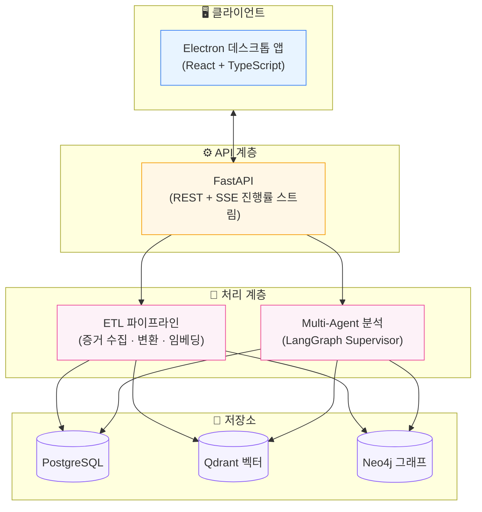
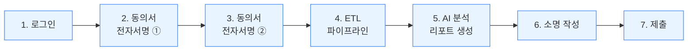
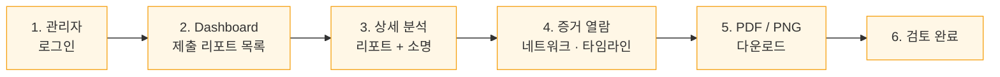
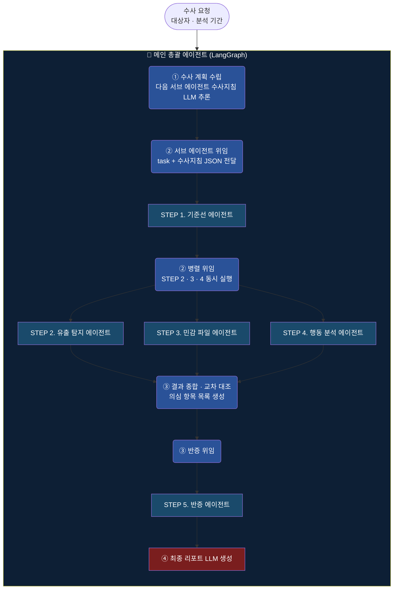

# AUTH — 정보 보안 자가 점검 시스템

> Multi-Agent AI 기반 내부 정보 보안 자가 감사 데스크톱 애플리케이션

한림대학교 소프트웨어학부 캡스톤 디자인 프로젝트 · 지능형의사결정시스템 연구실

---

## 📌 프로젝트 소개

**AUTH** 는 사원이 직접 동의 절차를 거쳐 자신의 업무 활동을 AI 기반으로 정기 점검받고, 결과에 대해 소명할 수 있도록 설계된 **내부 정보 보안 자가 점검 시스템**입니다.

기업 내부 정보 유출이 사회적 이슈로 떠오르는 가운데, 일방적인 감시 대신 **사원 동의 기반의 투명한 자가 점검 절차**를 제공함으로써 조직의 컴플라이언스를 강화하는 것을 목표로 합니다.

### 누가 어떻게 쓰나요?

| 역할 | 사용 시나리오 |
|---|---|
| **사원** | 분기별 정기 점검에 참여 → 동의서 전자서명 → AI 분석 결과 확인 → 필요 시 소명 작성 후 제출 |
| **관리자** | 제출된 리포트 inbox 확인 → 상세 분석(소명 · 증거 · 네트워크 · 타임라인) 검토 → PDF 보고서 다운로드 → 검토 완료 처리 |

---

## 🏗️ 시스템 아키텍처



---

## 🚦 핵심 기능

### 사원 흐름



- **로그인**: 사원 ID 기반
- **전자서명 ①**: 시스템 이용 동의 (업무 PC · 파일 · 사내 이메일 점검)
- **전자서명 ②**: 메신저 · 개인 이메일 접근 동의
- **ETL → AI 분석**: 진행 상황 SSE로 실시간 표시
- **리포트 열람**: 의심 파일 · 이메일 · 행동 패턴 시각화
- **소명 제출**: AI 판정 결과에 대한 자유 텍스트 소명

### 관리자 흐름



- **Dashboard**: 상태 · 소명 필요 여부 필터링 가능한 inbox
- **상세 분석 화면**:
  - 직원 리포트 + 사원 소명 텍스트
  - 의심 파일 · 이메일 본문 (모달)
  - 증거 네트워크 그래프 (관계 시각화)
  - 행동 타임라인
- **다운로드**: 보고서 PDF · 네트워크 그래프 PNG
- **검토 완료 처리**: 사원 inbox에서 상태 변경

---

## 🤖 Multi-Agent 분석 시스템

LangGraph 기반 Supervisor 패턴으로, **메인 에이전트가 5개의 전문 서브 에이전트를 동적으로 조율**합니다.

### Main Supervisor — 4단계 운영 사이클



### 5개 서브 에이전트

| # | 에이전트 | 역할 | 주 사용 저장소 |
|---|---|---|---|
| 1 | **기준선 에이전트** | 평소 외부 메일 · 파일 실행 · 활동 패턴 기준선 수립 | PostgreSQL |
| 2 | **유출 탐지 에이전트** | 외부 메일 · 개인 메일 · 메신저 · 익명 채널 발신 분석 | PostgreSQL |
| 3 | **민감 파일 에이전트** | 벡터 의미 검색으로 계약서 · 인사 · 기밀 문서 분류 | Qdrant + Neo4j |
| 4 | **행동 분석 에이전트** | 권한 밖 접근 · 이상 시간대 · 은폐 패턴 탐지 | PostgreSQL |
| 5 | **반증 에이전트** | 정상 업무 여부 검증 · 오탐 제거 | PostgreSQL |

### 최종 판정

종합 분석 후 **다항 가중치 기반 정량 평가**를 통해 **HIGH / MEDIUM / LOW / CLEAN** 4단계로 판정됩니다.

---

## 🛠️ 기술 스택

| 계층 | 기술 |
|---|---|
| **Frontend** | React 18 · TypeScript · Vite · Electron · @xyflow/react · @tanstack/react-query |
| **Backend** | FastAPI · LangGraph · LangChain · LangSmith · Pydantic |
| **저장소** | PostgreSQL · Qdrant · Neo4j |
| **AI 서비스** | LLM (GPT 계열) · 임베딩 (Upstage) · STT (CLOVA) |
| **문서 파싱** | pdfplumber · python-docx · python-evtx · extract-msg · hwp.js |
| **인프라** | Docker · electron-builder (Windows .exe 배포) |

---

## ⚙️ 설치 및 실행

### 사전 요구사항

| 항목 | 버전 |
|---|---|
| Python | 3.11 이상 |
| Node.js | 20 이상 |
| Docker Desktop | 최신 |
| Git | 최신 |

### 1단계 — 저장소 복제

```powershell
git clone <your-fork-url>
cd <repo-folder>
```

### 2단계 — Python 가상환경 및 패키지 설치

```powershell
python -m venv .venv
.venv\Scripts\Activate.ps1
pip install -r requirements.txt
```

### 3단계 — 환경변수 설정

```powershell
copy .env.example .env
```

`.env` 파일을 열어 필요한 값을 입력합니다.

```env
# 데이터베이스 비밀번호 (직접 지정)
POSTGRES_PASSWORD=<직접 설정>
NEO4J_PASSWORD=<직접 설정>

# AI 스테이지 사용 시 필수
OPENAI_API_KEY=sk-...
UPSTAGE_API_KEY=up-...
NCLOUD_ACCESS_KEY=...
NCLOUD_SECRET_KEY=...
```

> AI 스테이지(이미지 설명 · STT · 임베딩 · 개체명 추출)를 사용하지 않는 경우 API 키 없이도 ETL 기본 동작은 가능합니다.

### 4단계 — 인프라 기동

```powershell
.\scripts\clean_rebuild.ps1
```

위 스크립트는 다음을 수행합니다:
1. Docker 컨테이너(PostgreSQL) 기동
2. DB 스키마 초기화 (`schema.sql` 적용)

벡터/그래프 DB가 필요한 경우:

```powershell
docker compose -f docker\docker-compose.yml --profile ai up -d
```

### 5단계 — API 서버 실행

새 터미널에서:

```powershell
uvicorn api.main:app --host 0.0.0.0 --port 8000
```

서버가 뜨면 `http://localhost:8000/docs` 에서 Swagger UI를 확인할 수 있습니다.

### 6단계 — 프론트엔드 실행

#### 개발 모드 (Vite 핫리로드)

```powershell
cd frontend
npm install
npm run dev
```

#### Electron 데스크톱 앱 빌드

```powershell
cd frontend
npm run electron:build
```

빌드 결과물은 `frontend/dist_electron/` 에 Windows 설치 파일(.exe)로 생성됩니다.

### 7단계 — 증거 데이터 배치 및 파이프라인 실행

```
data/
  HYENA CTF/              ← 점검 대상 원본 파일
  converted_documents/    ← 변환 캐시 (있으면 재사용)
```

파이프라인 실행:

```powershell
python scripts\run_pipeline.py --drive-root-path ".\data\HYENA CTF"
```

> 데이터 규모에 따라 수십 분 정도 소요될 수 있습니다. 완료 후 자동으로 품질 검사 결과가 출력됩니다.

---

## 📂 프로젝트 구조

```
.
├─ frontend/         # React + Electron 데스크톱 앱
│   ├─ src/
│   │   ├─ components/    # 화면 컴포넌트 (Login, Consent, Report, AdminDashboard 등)
│   │   ├─ api/           # API 클라이언트
│   │   └─ flow.ts        # 화면 phase 전이 reducer
│   └─ electron/      # Electron 메인 프로세스
│
├─ api/              # FastAPI 라우터
│   ├─ main.py            # 앱 진입점
│   ├─ auth.py            # 로그인
│   ├─ audits.py          # 점검 세션 생성
│   ├─ consents.py        # 전자서명 저장
│   ├─ explanations.py    # 소명 제출
│   ├─ admin.py           # 관리자 inbox
│   ├─ agent_runner.py    # LangGraph 실행
│   └─ ...                # ingest, search, graph 등
│
├─ agent/            # Multi-Agent 시스템 (LangGraph)
│   ├─ graph.py           # Supervisor 4단계 사이클
│   ├─ nodes/             # 5개 서브 에이전트
│   ├─ tools/             # rdb · vector · graph 도구
│   └─ prompts/           # 에이전트 프롬프트
│
├─ etl/              # 16-stage ETL 파이프라인
│   ├─ pipeline.py        # 오케스트레이터
│   ├─ stages/            # 개별 stage 구현
│   ├─ converters/        # HWP → HWPX, DOC → DOCX
│   └─ extractors/        # XML 본문 추출
│
├─ scripts/          # 운영 스크립트
│   ├─ clean_rebuild.ps1  # 인프라 초기화
│   ├─ run_pipeline.py    # 파이프라인 실행
│   └─ audit_rdb_quality.py  # 품질 검사
│
├─ docker/           # Docker Compose 구성
├─ schema.sql        # PostgreSQL 스키마
└─ requirements.txt
```

---

## 🔄 ETL 파이프라인 (요약)

증거 데이터를 다음 7개 카테고리로 처리합니다:

```
수집(Scan) → 분류(Classify) → 이메일 파싱(PST/OST)
  → 문서 변환·추출(HWP/DOC/PDF) → 멀티모달 처리(STT/Vision)
  → 임베딩·엔티티·그래프 적재 → 품질 감사
```

각 단계별 옵션 플래그(`process_audio`, `process_images`, `process_embeddings`, `process_entities`, `process_graphdb`)로 선택적 활성화가 가능합니다.

> 16개 세부 스테이지의 상세 설명은 [docs/etl-stages.md](docs/etl-stages.md) 를 참조하세요.

---

## 🔌 API 라우터 요약

| 카테고리 | 경로 | 설명 |
|---|---|---|
| **인증** | `/auth/*` | 사원 · 관리자 로그인 |
| **점검 세션** | `/audits/*`, `/sessions/*` | 점검 세션 생성/상태 |
| **동의** | `/sessions/{id}/consents` | 전자서명 저장 |
| **파이프라인** | `/ingest/*` | ETL 작업 실행 · 진행률 |
| **AI 분석** | `/agent/*` | LangGraph 실행 · SSE 이벤트 |
| **증거 조회** | `/files`, `/emails`, `/entities`, `/summary` | 증거 데이터 열람 |
| **검색** | `/search/*` | 이메일 · 파일 · 콘텐츠 검색 |
| **그래프** | `/graph/*` | 노드 · 엣지 조회 |
| **결과** | `/findings/*` | 분석 결과 · Verdict |
| **소명** | `/sessions/{id}/explanations` | 소명 제출 |
| **관리자** | `/admin/*` | inbox · 검토 |

전체 명세는 서버 실행 후 `http://localhost:8000/docs` 에서 확인할 수 있습니다.

---

## 🔒 데이터 처리 및 프라이버시

본 시스템은 **사원 동의 기반의 자가 점검**을 원칙으로 설계되었습니다.

- **이중 전자서명**: 시스템 이용 동의 + 메신저/개인 이메일 접근 동의를 각각 받습니다.
- **수집 범위 명시**: 동의서에 점검 대상 데이터(파일 접근 기록 · 이메일 발송 내역 · 메신저 로그)를 명시합니다.
- **로컬 처리 원칙**: 증거 데이터는 로컬 인프라(Docker)에서 처리되며, 외부로 전송되지 않습니다. (AI 추론을 위한 텍스트 일부만 외부 LLM API로 전송될 수 있음 — 사용 시 별도 고지)
- **개인정보 보호법 준수**: 수집된 정보는 내부 보안 감사 목적으로만 사용됩니다.

---

## 👥 팀 및 라이선스

**한림대학교 소프트웨어학부 캡스톤 디자인** · 지능형의사결정시스템 연구실

### 사용 오픈소스 라이선스 고지

본 프로젝트는 다양한 오픈소스 라이브러리를 사용합니다. 주요 라이선스:

- **MIT**: React, FastAPI, LangGraph, LangChain, Electron, Vite, @xyflow/react 외 다수
- **Apache 2.0**: TypeScript, Qdrant, hwp.js, python-evtx 외
- **BSD**: Uvicorn, pandas, numpy 외
- **GPLv3**: Neo4j Community Edition, extract-msg
- **LGPL**: psycopg2, py7zr
- **PostgreSQL License**: PostgreSQL

GPL 계열 의존성을 포함하므로, 외부 배포 시 각 라이선스 조건을 확인하시기 바랍니다.

---

## 📚 추가 문서

- [ETL 스테이지 상세](docs/etl-stages.md) — 16-stage 세부 설명 (선택)
- API 문서: 서버 실행 후 `http://localhost:8000/docs`
